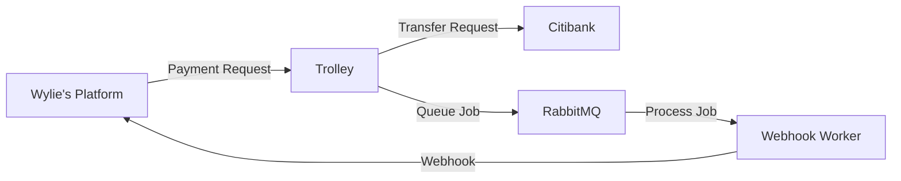

# Payment System Simulation

A multi-tier payment processing system simulating real-world payment flows between platforms, payment processors, and banks. Built to learn about webhooks, message queues, idempotency, and asynchronous processing.

## Architecture


## Features

### Security
- **API Key Authentication & HMAC Signatures** - Secure communication between services
- **Idempotency Protection** - Prevents duplicate transactions at each layer
- **Async Webhook Delivery** - RabbitMQ queue with worker-based processing
- **Exponential Backoff Retries** - Smart retry logic (1min → 2min → 4min → 8min → 16min)
- **Max 5 Retry Attempts** - Prevents infinite loops

### Async Webhook Delivery
- **RabbitMQ Message Queue** - Decouples webhook delivery from payment processing
- **Worker-based Processing** - Background workers handle webhook delivery
- **Exponential Backoff** - Smart retry logic with jitter (1min → 2min → 4min → 8min → 16min)
- **Max Retry Limits** - Gives up after 5 attempts to prevent infinite loops

### Payment Flow
1. **Wylie's Platform** initiates payment to contractor
2. **Trolley** validates and processes payment
3. **Citibank** executes bank transfer
4. **Webhook Worker** notifies Wylie's Platform asynchronously
5. **Wylie's Platform** records payment completion

## Tech Stack

- **Node.js** - Runtime
- **Express** - Web framework
- **PostgreSQL** - Database
- **RabbitMQ** - Message queue
- **amqplib** - RabbitMQ client

## Quick Start
```bash
# Install dependencies
npm install

# Start PostgreSQL (ensure it's running on localhost:5432)

# Set up database
psql -U postgres -f shared/schema.sql

# Start RabbitMQ
docker run -d --name rabbitmq -p 5672:5672 -p 15672:15672 rabbitmq:3-management

# Run all services
npm start
```

**Services:**
- Wylie's Platform: `localhost:3000`
- Trolley: `localhost:3001`  
- Citibank: `localhost:3002`

**Test a payment:**
```bash
POST http://localhost:3000/contractors/1/pay
Content-Type: application/json

{
  "amount": 100
}
```

## Key Concepts

This project demonstrates:
- Multi-tier system architecture
- Webhook design and retry patterns
- Message queues (RabbitMQ)
- Idempotency in distributed systems
- Async/await and worker processes
- HMAC signature verification
